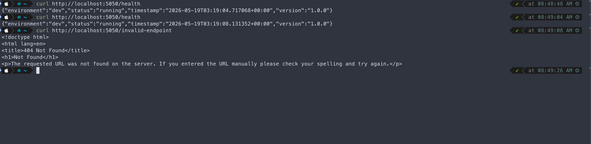

# Cohort2 Application

A simple production-style Flask REST API with:
- Structured logging
- Modular project structure
- Unit tests
- Health check endpoint

---

# Project Structure

```text
cohort-app/
│
├── src/
│   ├── app.py
│   │
│   ├── models/
│   │   └── health_response.py
│   │
│   ├── utils/
│   │   └── logger_config.py
│   │
│   └── routes/
│       └── health_routes.py
│
├── tests/
│   └── test_app.py
│
├── requirements.txt
├── README.md
├── .gitignore
│
└── venv/
```

---

# Prerequisites

- Python 3.10+
- pip

Verify installation:

```bash
python3 --version
pip --version
```

---

# Setup

## 1. Clone Repository

```bash
git clone <repository-url>
cd cohort-app
```

---

## 2. Create Virtual Environment

### Mac/Linux

```bash
python3 -m venv venv
source venv/bin/activate
```

### Windows

```bash
python -m venv venv
venv\Scripts\activate
```

---

## 3. Install Dependencies

```bash
pip install -r requirements.txt
```


---

# Run Application

Start the Flask API server:

```bash
python src/app.py
```

Server starts on:

```text
http://localhost:5050
```

App running logs:
```text
Starting Flask REST API server...
Application is running on port 5050
 * Serving Flask app 'app'
 * Debug mode: off
```


---

# API Endpoints

## Health Check

### Request

```http
GET /health
```

### Curl Example

```bash
curl http://localhost:5050/health
```

### Sample Response

```json
{
  "status": "running",
  "timestamp": "2026-05-16T06:10:15.123456+00:00",
  "version": "1.0.0",
  "environment": "dev"
}
```


---

# Structured Logging

Application logs all API requests/responses in structured JSON format.

## Sample Logs

```json
{"timestamp": "2026-05-19T03:19:08.131248+00:00", "event": "api_request", "method": "GET", "path": "/health", "client_ip": "127.0.0.1"}
{"timestamp": "2026-05-19T03:19:08.131550+00:00", "event": "api_response", "response": {"status_code": 200}}
{"timestamp": "2026-05-19T03:19:26.348144+00:00", "event": "api_request", "method": "GET", "path": "/invalid-endpoint", "client_ip": "127.0.0.1"}
{"timestamp": "2026-05-19T03:19:26.348882+00:00", "event": "api_response", "response": {"status_code": 404}}
```

---

# Run Tests

Run all unit tests:

```bash
python -m unittest discover tests
```


---

# Test Coverage

Current test cases include:

- Health endpoint success response
- Invalid endpoint handling
- POST/PUT method not allowed

---

# Sample Test Output

```text
....
$ python -m unittest discover tests                                    
Starting Flask REST API server...
{"timestamp": "2026-05-19T03:37:27.691820+00:00", "event": "api_request", "method": "POST", "path": "/health", "client_ip": "127.0.0.1"}
{"timestamp": "2026-05-19T03:37:27.692151+00:00", "event": "api_response", "response": {"status_code": 405}}
.{"timestamp": "2026-05-19T03:37:27.692397+00:00", "event": "api_request", "method": "PUT", "path": "/health", "client_ip": "127.0.0.1"}
{"timestamp": "2026-05-19T03:37:27.692475+00:00", "event": "api_response", "response": {"status_code": 405}}
.{"timestamp": "2026-05-19T03:37:27.692724+00:00", "event": "api_request", "method": "GET", "path": "/health", "client_ip": "127.0.0.1"}
{"timestamp": "2026-05-19T03:37:27.692790+00:00", "event": "api_response", "response": {"status_code": 200}}
.{"timestamp": "2026-05-19T03:37:27.693006+00:00", "event": "api_request", "method": "GET", "path": "/invalid-endpoint", "client_ip": "127.0.0.1"}
{"timestamp": "2026-05-19T03:37:27.693077+00:00", "event": "api_response", "response": {"status_code": 404}}
.
----------------------------------------------------------------------
Ran 4 tests in 0.007s

OK
```

---

# requirements.txt

```txt
Flask==3.1.0
Werkzeug==3.1.3
```

---