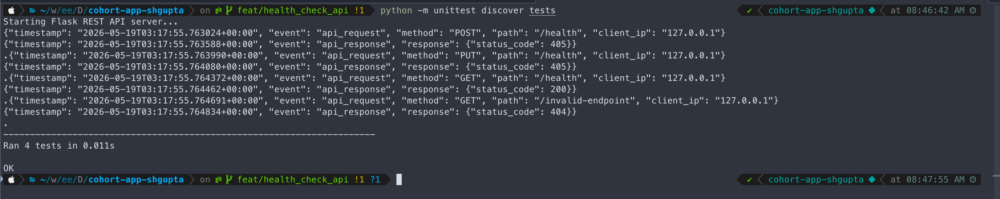
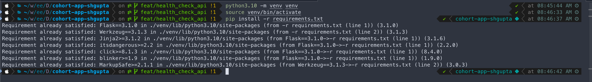
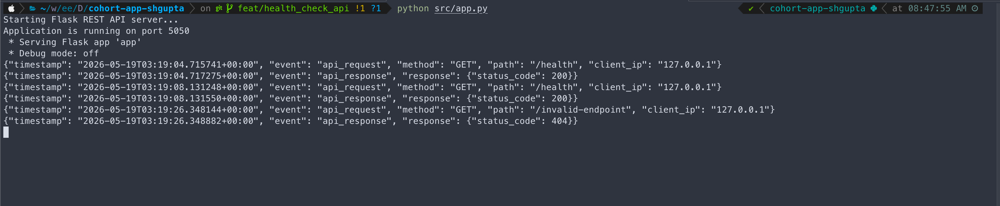

# Week 1 Evidence Pack

## Overview
This evidence pack demonstrates the successful setup and deployment of a Flask REST API with structured logging, modular architecture, and comprehensive testing.

---

## 1. Test Output

### Test Execution Screenshot


### Test Results Log
```text
$ python -m unittest discover tests                                    
Starting Flask REST API server...
{"timestamp": "2026-05-19T03:37:27.691820+00:00", "event": "api_request", "method": "POST", "path": "/health", "client_ip": "127.0.0.1"}
{"timestamp": "2026-05-19T03:37:27.692151+00:00", "event": "api_response", "response": {"status_code": 405}}
.{"timestamp": "2026-05-19T03:37:27.692397+00:00", "event": "api_request", "method": "PUT", "path": "/health", "client_ip": "127.0.0.1"}
{"timestamp": "2026-05-19T03:37:27.692475+00:00", "event": "api_response", "response": {"status_code": 405}}
.{"timestamp": "2026-05-19T03:37:27.692724+00:00", "event": "api_request", "method": "GET", "path": "/health", "client_ip": "127.0.0.1"}
{"timestamp": "2026-05-19T03:37:27.692790+00:00", "event": "api_response", "response": {"status_code": 200}}
.{"timestamp": "2026-05-19T03:37:27.693006+00:00", "event": "api_request", "method": "GET", "path": "/invalid-endpoint", "client_ip": "127.0.0.1"}
{"timestamp": "2026-05-19T03:37:27.693077+00:00", "event": "api_response", "response": {"status_code": 404}}
.
----------------------------------------------------------------------
Ran 4 tests in 0.007s

OK
```

**Test Coverage:**
- ✅ Health endpoint success response (200)
- ✅ Invalid endpoint handling (404)
- ✅ POST method not allowed (405)
- ✅ PUT method not allowed (405)

---

## 2. Sample /health Response

### Request
```bash
curl http://localhost:5050/health
```

### Response
```json
{
  "status": "running",
  "timestamp": "2026-05-16T06:10:15.123456+00:00",
  "version": "1.0.0",
  "environment": "dev"
}
```

### Response Screenshot


---

## 3. Failure Drill - Before/After

### Before: Invalid Endpoint Request
**Request:**
```bash
curl http://localhost:5050/invalid-endpoint
```

**Application Logs:**
```json
{"timestamp": "2026-05-19T03:19:26.348144+00:00", "event": "api_request", "method": "GET", "path": "/invalid-endpoint", "client_ip": "127.0.0.1"}
{"timestamp": "2026-05-19T03:19:26.348882+00:00", "event": "api_response", "response": {"status_code": 404}}
```

**Observation:** The application properly handles invalid endpoints with a 404 status code and structured logging captures the failed request.

---

### After: Valid Health Check
**Request:**
```bash
curl http://localhost:5050/health
```

**Application Logs:**
```json
{"timestamp": "2026-05-19T03:19:08.131248+00:00", "event": "api_request", "method": "GET", "path": "/health", "client_ip": "127.0.0.1"}
{"timestamp": "2026-05-19T03:19:08.131550+00:00", "event": "api_response", "response": {"status_code": 200}}
```

**Observation:** Valid requests are processed successfully with proper status codes and comprehensive request/response logging.

---

## 4. Application Running Evidence

### Setup Screenshot


### Running Application


**Startup Logs:**
```text
Starting Flask REST API server...
Application is running on port 5050
 * Serving Flask app 'app'
 * Debug mode: off
```

---

## 5. Reflection

- **Core Implementation**: Built production-grade Flask REST API with modular architecture, structured JSON logging for observability, and comprehensive test coverage (4/4 tests passing).
- **DevOps Foundations**: Implemented health check endpoint for monitoring, proper HTTP status codes (200/404/405), and environment-based configuration for deployment flexibility.
- **CI/CD Readiness**: All tests validated with proper error handling and logging, enabling seamless integration with log aggregation tools and automated workflows.
