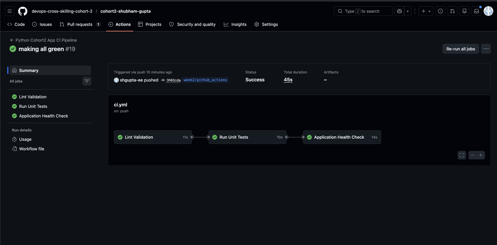
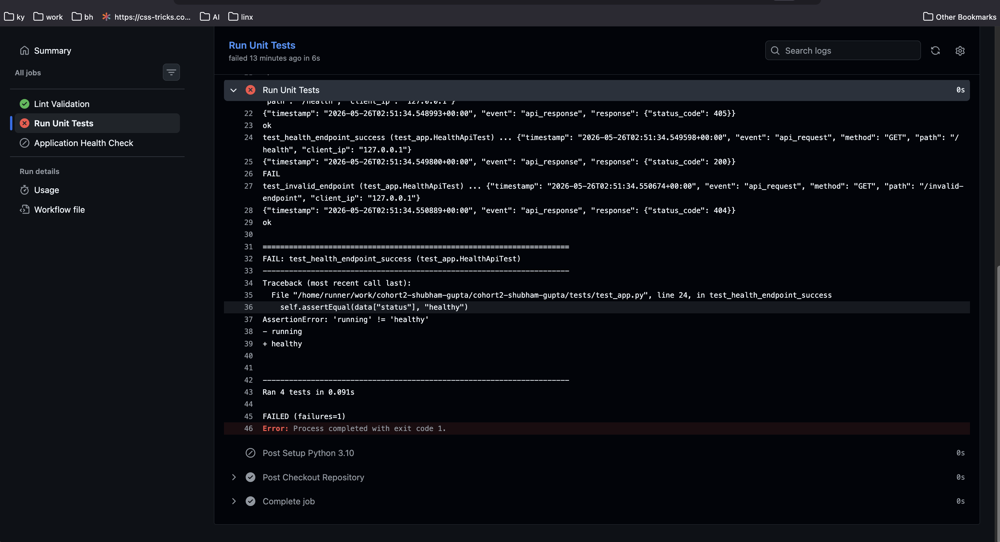
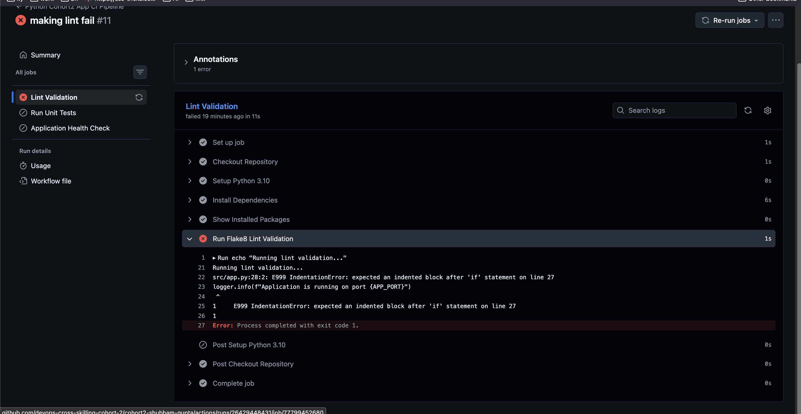
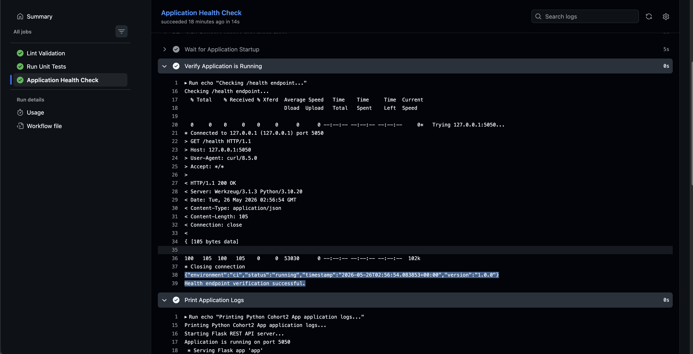

# Week 2 Evidence Pack

## Overview
This evidence pack demonstrates the implementation of a GitHub Actions based CI pipeline for the Python application. 
The pipeline validates code quality, executes automated tests, starts the application in an automated runtime environment, and verifies application health through the `/health` endpoint.

---

# 1. CI/CD Pipeline Overview

## Pipeline Features Implemented

- ✅ Trigger on `push`
- ✅ Trigger on `pull_request`
- ✅ Dependency installation
- ✅ Lint validation using `flake8`
- ✅ Automated unit test execution
- ✅ Automated application startup
- ✅ Automated `/health` endpoint verification
- ✅ Structured pipeline logs for debugging

---

# 2. Passing Workflow Run

## Github Actions Link

```text
https://github.com/devops-cross-skilling-cohort-2/cohort2-shubham-gupta/actions
```

## Successful Workflow Run Link

```text
https://github.com/devops-cross-skilling-cohort-2/cohort2-shubham-gupta/actions/runs/26429614448
```

## Passing Workflow Screenshot



## Successful Pipeline Stages

```text
✔ Lint Validation
✔ Unit Tests
✔ Flask Application Startup and /health Endpoint Verification
```

---

# 3. Failing Workflow Run

## Failed Workflow Run Link

```text
https://github.com/devops-cross-skilling-cohort-2/cohort2-shubham-gupta/actions/runs/26429470562
```

## Failed Workflow Screenshot



---

# 4. Failure Drill

## Failure Scenario

The workflow initially failed during the `lint-check` job for Python application inside GitHub Actions.

## Failure Logs

```text
Running lint validation...
src/app.py:28:2: E999 IndentationError: expected an indented block after 'if' statement on line 27
logger.info(f"Application is running on port {APP_PORT}")
 ^
1     E999 IndentationError: expected an indented block after 'if' statement on line 27
1
Error: Process completed with exit code 1.
```

## Failed Lint Screenshot



## Fixing Lint Error


---

# 5. Deployed Health Response Output

## Health Endpoint Verification Command

```bash
curl http://127.0.0.1:5050/health
```

## Health Response

```json
{"environment":"ci","status":"running","timestamp":"2026-05-26T02:56:54.083853+00:00","version":"1.0.0"}
```

## Health Check Screenshot



---

# 6. GitHub Actions Workflow

## Workflow File

```text
.github/workflows/ci.yml
```

## Workflow Jobs

### 1. Lint Validation
- Install dependencies
- Run `flake8`
- Validate code quality

### 2. Unit Tests
- Execute unit tests
- Validate API functionality

### 3. Application Health Check
- Start Flask application
- Verify runtime startup
- Validate `/health` endpoint response

---

# 7. CI Pipeline Execution Evidence

## Lint Validation Logs

```text
Running lint validation...
Lint validation completed successfully.
```

---

## Unit Test Logs

```text
Ran 4 tests in 0.007s

OK
```

---

## Health Check Logs

```text
Checking /health endpoint...
{"environment":"ci","status":"running","timestamp":"2026-05-26T02:56:54.083853+00:00","version":"1.0.0"}
```

---

# 8. Reflection

- Implemented a GitHub Actions CI pipeline with automated quality validation, testing, and runtime verification.
- Added automated health validation to ensure the application starts correctly inside a CI runtime environment.
- Improved debugging capabilities by adding structured logs and application log collection during workflow execution.
- Gained practical understanding of Python package resolution issues in CI environments and proper module-based application execution.

---