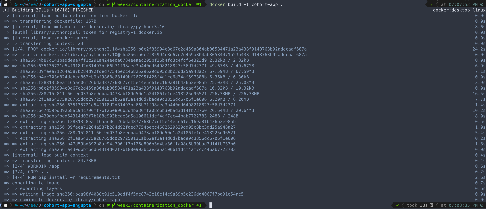
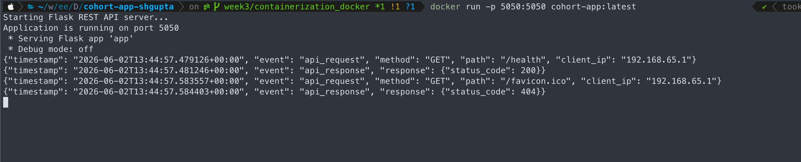
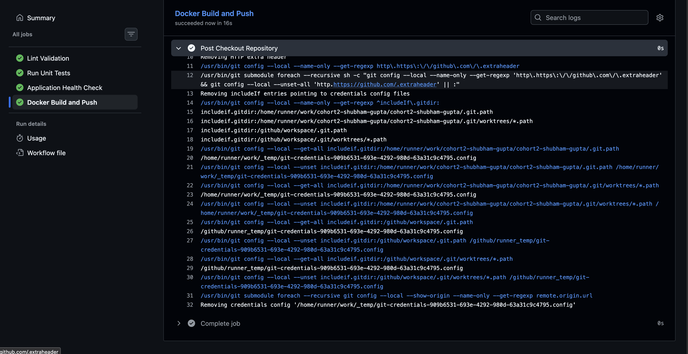
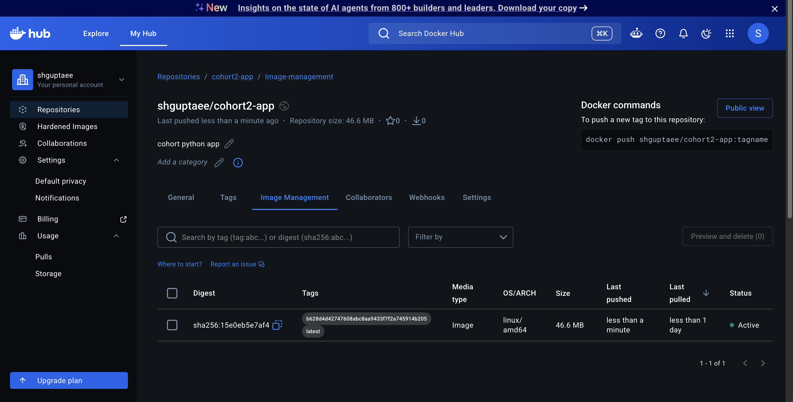
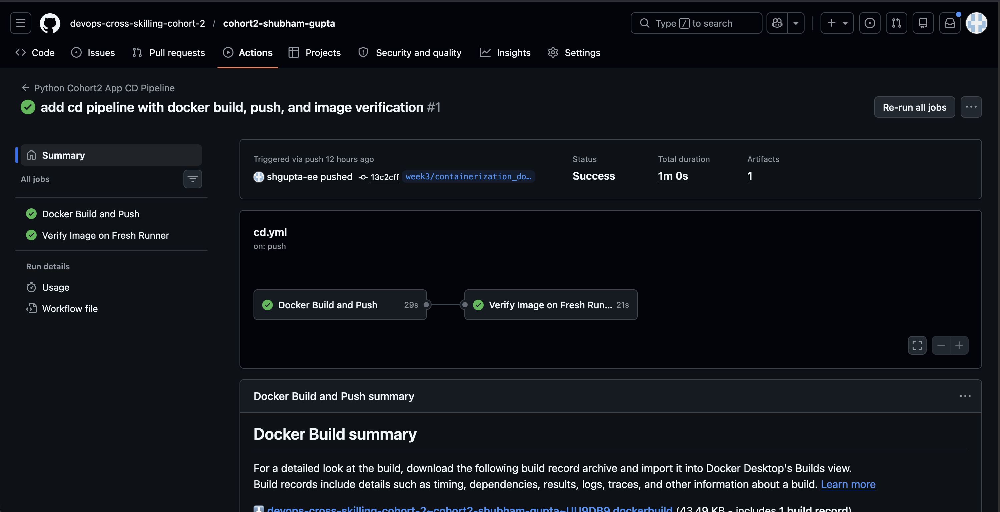
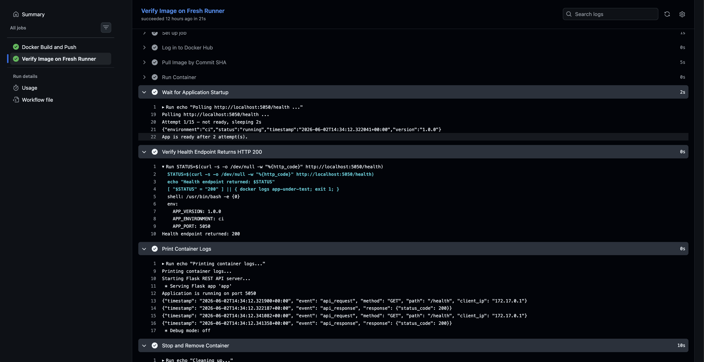
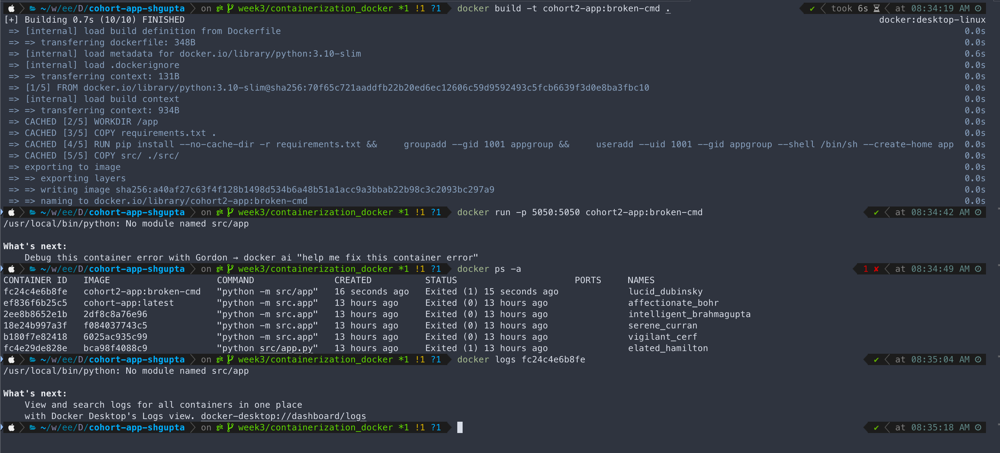
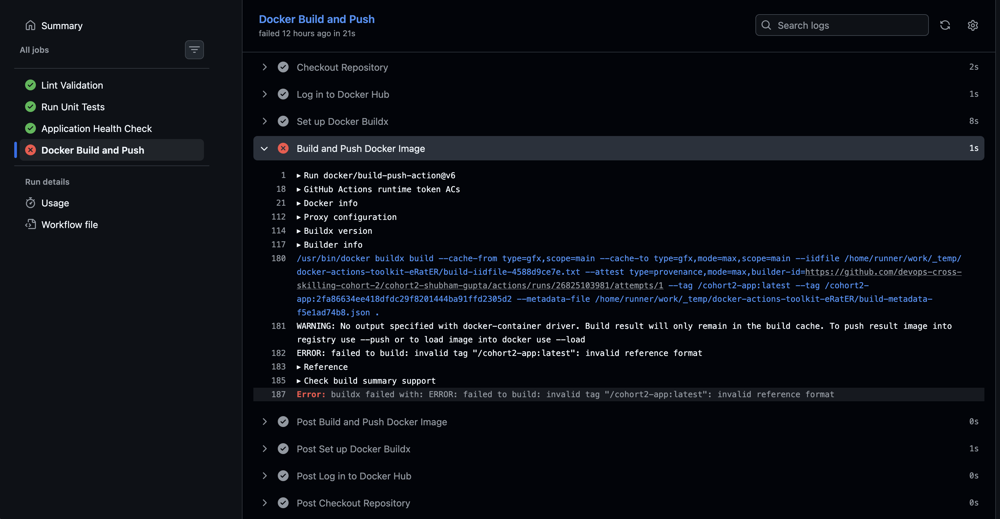

# Week 3 Evidence Pack

## Overview

This evidence pack demonstrates building a Docker container image for the Python Flask application, standardising runtime configuration via environment variables, and integrating Docker image build, push, and verification into the CD pipeline.

---

# 1. Docker Implementation Overview

## Features Implemented

- ✅ `Dockerfile` with optimised layer caching
- ✅ `.dockerignore` to exclude unnecessary files from build context
- ✅ Non-root user (`appuser`, UID 1001) for container security
- ✅ Slim base image (`python:3.10-slim`) for minimal image size
- ✅ Runtime configuration via environment variables
- ✅ Local image build and run verified
- ✅ Image pushed to Docker Hub (`shguptaee/cohort2-app`)
- ✅ CD pipeline: Docker Build and Push → Verify Image on Fresh Runner
- ✅ Failure drill: broken container diagnosed and fixed

---

# 2. Dockerfile

```dockerfile
FROM python:3.10-slim

WORKDIR /app

COPY requirements.txt .

RUN pip install --no-cache-dir -r requirements.txt && \
    groupadd --gid 1001 appgroup && \
    useradd --uid 1001 --gid appgroup --shell /bin/sh --create-home appuser

COPY src/ ./src/

USER appuser

EXPOSE 5050

CMD ["python", "-m", "src.app"]
```

### Key decisions

| Decision | Reason |
|----------|--------|
| `python:3.10-slim` | Strips build tools and compiler — reduces image from ~1.1 GB to ~200 MB |
| `COPY requirements.txt` before `COPY src/` | Docker layer cache: pip install only re-runs when dependencies actually change, not on every code change |
| Single `RUN` with `&&` | Combines pip install + user creation into one layer — fewer layers = smaller image metadata |
| `groupadd` + `useradd` + `USER appuser` | Container runs as non-root — reduces blast radius of any vulnerability |
| `CMD ["python", "-m", "src.app"]` | Module invocation (`-m`) adds CWD to `sys.path`, required for `from src.x import y` to resolve correctly |
| `--no-cache-dir` | Prevents pip from storing its download cache inside the image layer |

---

# 3. Local Docker Build

## Command

```bash
docker build -t cohort-app .
```

## Build Output

The build pulled `python:3.10-slim`, installed dependencies, created the non-root user, and copied the application source. Layer caching was active — `requirements.txt` layer was cached on repeat builds.

## Screenshot



---

# 4. Local Docker Run

## Command

```bash
docker run -p 5050:5050 \
  -e APP_VERSION=1.0.0 \
  -e APP_ENVIRONMENT=dev \
  -e APP_PORT=5050 \
  cohort-app:latest
```

## Application Logs

The container started Flask on port 5050. Structured JSON logs confirmed the application was running and responding to requests:

```json
{"timestamp": "2026-06-02T13:44:57.479126+00:00", "event": "api_request",  "method": "GET", "path": "/health", "client_ip": "192.168.65.1"}
{"timestamp": "2026-06-02T13:44:57.481246+00:00", "event": "api_response", "response": {"status_code": 200}}
```

## Screenshot



---

# 5. CI Pipeline — Docker Build and Push (Initial Integration)

## Context

Before the dedicated CD pipeline was introduced, the `docker-build-push` job was added directly to `ci.yml` to validate that the image build and push worked end-to-end. This was a deliberate first step — prove the mechanism works in CI before promoting it to a dedicated CD pipeline.

## Pipeline File

```text
.github/workflows/ci.yml
```

## Job

The `docker-build-push` job ran after `health-check`, checked out the repo, authenticated to Docker Hub, and built and pushed the image using `docker/build-push-action`.

## Screenshot



---

# 6. Docker Hub — Image Pushed via CI Pipeline

## Repository

```
shguptaee/cohort2-app
```

## Tags

| Tag | Purpose |
|-----|---------|
| `latest` | Always points to the most recent push |
| `<git-sha>` | Immutable — pinned to the exact commit that produced the image |

## Image Details

- **Size:** 46.6 MB (compressed)
- **OS/Arch:** linux/amd64
- **Base:** `python:3.10-slim`

The image appeared on Docker Hub confirming the CI push was successful. This was the first end-to-end proof that the build and registry integration worked correctly.

## Screenshot



---

# 7. CD Pipeline — Docker Build and Push

## Context

With the CI integration verified, the `docker-build-push` job was moved to a dedicated CD pipeline (`cd.yml`). The CD pipeline is separate from CI by design:

- **CI (`ci.yml`)** — runs on every push and PR: lint → unit tests → health check
- **CD (`cd.yml`)** — runs on merge to `main`: docker build → push → verify image

This separation ensures only code that has passed all CI checks produces a published image.

## Pipeline File

```text
.github/workflows/cd.yml
```

## Pipeline Jobs

```
Docker Build and Push → Verify Image on Fresh Runner
```

The `docker-build-push` job checks out the repo, authenticates to Docker Hub, and pushes the image tagged with both `:latest` and `:<git-sha>`.

---

# 8. CD Pipeline — Verify Image on Fresh Runner

## What this proves

The `verify-image` job runs on a **separate, fresh GitHub Actions runner** with an empty Docker daemon. It:

1. Logs in to Docker Hub
2. Pulls the image using the immutable `:<git-sha>` tag — a real network pull from the registry
3. Runs the container with runtime env vars passed via `-e`
4. Polls `/health` until the app is ready (up to 30s)
5. Verifies the endpoint returns HTTP 200
6. Prints container logs
7. Stops and removes the container

This proves the image was actually pushed to the registry and is runnable by anyone — not just cached on the build runner.

## Verify Image Job Logs

```text
Polling http://localhost:5050/health ...
App is ready after 2 attempt(s).
Health endpoint returned: 200
```

Container logs showed structured JSON output confirming Flask started on port 5050 and responded correctly:

```json
{"timestamp": "...", "event": "api_response", "response": {"status_code": 200}}
```

## Screenshot — Full CD Pipeline Green



## Screenshot — Verify Image Job Detail



---

# 9. Failure Drill

## Drill 1 — Wrong CMD (ModuleNotFoundError)

### Break

Changed `CMD` in the `Dockerfile` to use direct file invocation instead of module invocation:

```dockerfile
CMD ["python", "src/app.py"]
```

Built and ran the broken image:

```bash
docker build -t cohort2-app:broken-cmd .
docker run -p 5050:5050 cohort2-app:broken-cmd
```

### Failure

Container exited immediately with:

```
ModuleNotFoundError: No module named 'src'
```

**Root cause:** `python src/app.py` adds the script's directory (`/app/src`) to `sys.path`. From there, `from src.config.settings import APP_PORT` fails because there is no `src` package inside `/app/src`. The `-m` flag adds the working directory (`/app`) to `sys.path` instead, which is where `src/` lives as a package.

### Diagnosis

```bash
docker ps -a                    # container shown as Exited (1)
docker logs <container-id>      # showed full traceback
```

### Fix

Reverted `CMD` to module invocation:

```dockerfile
CMD ["python", "-m", "src.app"]
```

### Screenshot



---

## Drill 2 — Empty DOCKERHUB_USERNAME (Invalid Tag in CI)

### Break

The `docker-build-push` job referenced `${{ vars.DOCKERHUB_USERNAME }}` which had not been set as a repository variable — it resolved to an empty string, producing an invalid image tag:

```
/cohort2-app:latest   ← leading slash, username missing
```

### Failure

```
ERROR: failed to build: invalid tag "/cohort2-app:latest": invalid reference format
```

### Diagnosis

The pipeline log showed the `with:` block for `docker/login-action` had no `username:` line — confirming the variable was empty. The build step then attempted to tag the image with a malformed reference.

### Fix

Hardcoded the Docker Hub username directly in `cd.yml` since it is not a sensitive value:

```yaml
username: shguptaee
tags: |
  shguptaee/cohort2-app:latest
  shguptaee/cohort2-app:${{ github.sha }}
```

### Screenshot



---

# 10. Reflection

- Built a production-grade Docker image iteratively — starting brute-force and optimising step by step through base image selection, layer caching, combined `RUN` commands, and non-root execution.
- Understood the difference between `python file.py` and `python -m module` and why it matters inside a container where the working directory is the import root.
- Learned that `workflow_run` in GitHub Actions only reads workflow files from the default branch — a non-obvious constraint that required understanding how GitHub resolves workflow definitions.
- Verified the full push-pull loop: image built in CI, pushed to Docker Hub, pulled on a fresh runner, and health-checked — proving registry reachability end-to-end.
- Diagnosed two failure modes (wrong CMD, empty variable) from container and pipeline logs alone, without needing to modify running systems.

---
