# Week 4 Evidence Pack

---

## Week
**Week number:** 4
**Assignment link:** https://github.com/devops-cross-skilling-cohort-2/cohort2-shubham-gupta
**Target path used:** A (Kubernetes)

---

## What I Implemented
- Created K3D local Kubernetes cluster (`cohort-local`) with 1 server + 1 agent node
- Deployed Flask app to `cohort-dev` namespace using Namespace, Deployment, Service, ConfigMap manifests
- Configured readiness and liveness probes on `/health` endpoint
- Set CPU and memory requests/limits on the container
- Verified env vars injected correctly from ConfigMap into running pods
- Demonstrated scaling (2 → 4 → 2 replicas) and rolling update with rollout history
- Failure drill: forced readiness probe failure, diagnosed via `kubectl describe` and events, recovered
- Registered self-hosted GitHub Actions runner (macOS ARM64) and ran `k8s-apply` CI job against local cluster

---

## Definition of Done Checklist
- ✅ Core scope completed — Namespace, Deployment, Service, ConfigMap, probes, requests/limits
- ✅ Week DoD checklist completed — all 6 items met (see below)
- ✅ Failure drill completed — readiness probe broken and recovered
- ✅ Evidence pack attached

### DoD Items
| Item | Status |
|------|--------|
| Workload reaches Ready state | ✅ Both pods `1/1 Running` |
| Service endpoint responds successfully | ✅ `curl /health` returns HTTP 200 |
| Probes configured and validated | ✅ Confirmed via `kubectl describe` |
| Resource requests/limits set | ✅ `cpu: 100m/250m`, `memory: 128Mi/256Mi` |
| Scaling event demonstrated | ✅ Scaled to 4 replicas and back to 2 |
| Failure drill evidence included | ✅ Probe broken, diagnosed, fixed |

---

## Evidence Pack

**Repository/PR link:** https://github.com/devops-cross-skilling-cohort-2/cohort2-shubham-gupta/pull/4

**CI run links:** GitHub Actions → K8s Non-Prod Apply → `Apply Manifests to dev` https://github.com/devops-cross-skilling-cohort-2/cohort2-shubham-gupta/actions/runs/27250216202

**Deployment verification proof:** Service endpoint curl returning `{"environment":"dev","status":"running","timestamp":"...","version":"1.0.0"}` — screenshot below

**Security or quality check proof:** Container runs as non-root user (`appuser`, UID 1001) from Week 3 image; resource limits prevent runaway CPU/memory usage

**Observability/operations proof:** Readiness and liveness probes validated via `kubectl describe`; structured JSON application logs visible via `kubectl logs`

---

## 1. K3D Cluster Setup

### Cluster Creation Error (First Attempt)

Port `8080` was already in use on the host — K3D failed to bind the load balancer port.

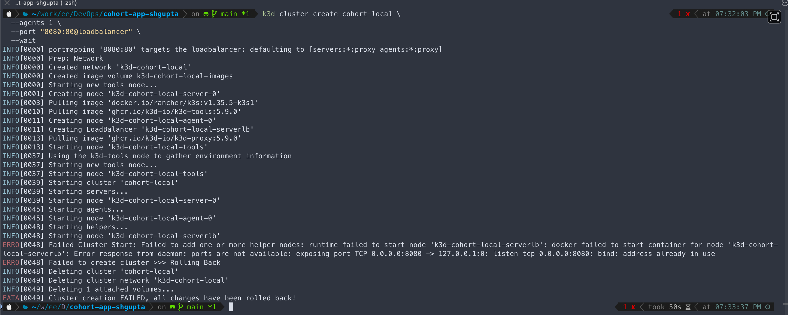

### Cluster Creation Success

Removed the port mapping flag and recreated. Cluster `cohort-local` came up with server and agent nodes both `Ready`.

```bash
k3d cluster create cohort-local --agents 1 --wait
kubectl cluster-info
kubectl get nodes
```

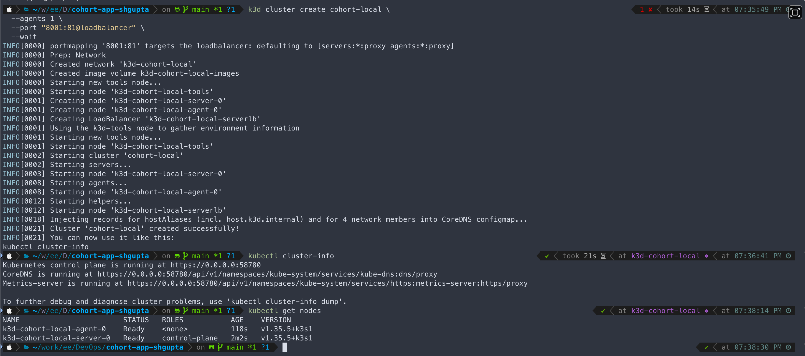

---

## 2. Kubernetes Manifests

**File structure:**
```
k8s/
  dev/
    namespace.yaml
    configmap.yaml
    deployment.yaml
    service.yaml
```

**Namespace:** `cohort-dev`

**ConfigMap keys:** `APP_VERSION=1.0.0`, `APP_ENVIRONMENT=dev`, `APP_PORT=5050`

**Deployment highlights:**
- Image: `shguptaee/cohort2-app:latest`
- Replicas: 2
- Strategy: `RollingUpdate` (`maxUnavailable: 1`, `maxSurge: 1`)
- Resources: `requests cpu:100m memory:128Mi` / `limits cpu:250m memory:256Mi`
- Readiness probe: `GET /health:5050` — `delay:5s period:10s failureThreshold:3`
- Liveness probe: `GET /health:5050` — `delay:10s period:15s failureThreshold:3`

---

## 3. Deployment and Service Verification

```bash
kubectl get pods -n cohort-dev
kubectl get services -n cohort-dev
kubectl port-forward svc/cohort2-app-svc 9090:80 -n cohort-dev &
curl http://localhost:9090/health
kubectl logs cohort2-app-<pod-id> -n cohort-dev
```

**Health response:**
```json
{"environment":"dev","status":"running","timestamp":"2026-06-09T20:10:24.320641+00:00","version":"1.0.0"}
```

Application logs showed structured JSON for every probe request confirming pods were healthy and serving traffic.

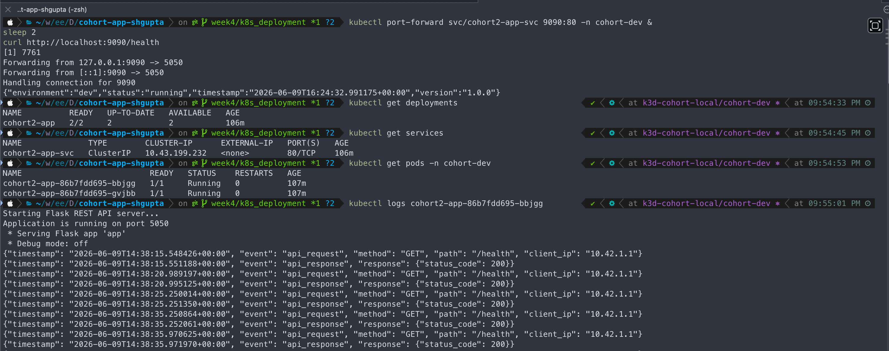

---

## 4. Probes and Resource Controls Verification

```bash
kubectl describe pod -n cohort-dev -l app=cohort2-app | grep -A 6 "Liveness\|Readiness"
kubectl describe pod -n cohort-dev -l app=cohort2-app | grep -A 4 "Limits\|Requests"
kubectl exec -n cohort-dev <pod> -- env | grep APP_
```

**Confirmed output:**
- Liveness: `http-get http://:5050/health delay=10s period=15s #failure=3`
- Readiness: `http-get http://:5050/health delay=5s period=10s #failure=3`
- Limits: `cpu:250m memory:256Mi`
- Requests: `cpu:100m memory:128Mi`
- Env vars: `APP_VERSION=1.0.0`, `APP_ENVIRONMENT=dev`, `APP_PORT=5050`

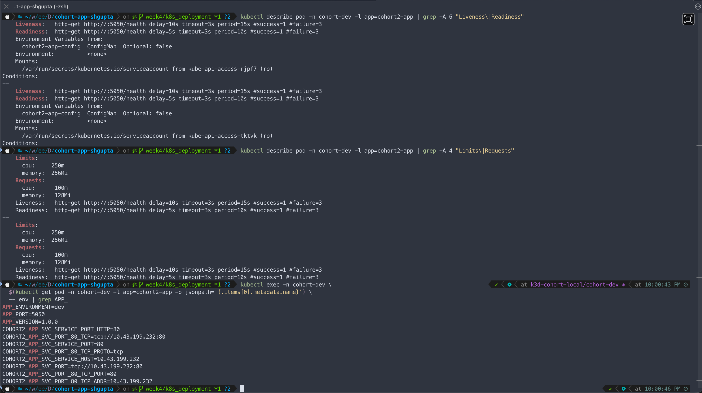

---

## 5. Scaling and Rollout

### Scale up to 4, back to 2

```bash
kubectl scale deployment cohort2-app -n cohort-dev --replicas=4
kubectl scale deployment cohort2-app -n cohort-dev --replicas=2
```

### Trigger rolling update

```bash
kubectl set env deployment/cohort2-app -n cohort-dev APP_VERSION=1.0.1
kubectl rollout status deployment/cohort2-app -n cohort-dev
kubectl rollout history deployment/cohort2-app -n cohort-dev
```

**Rollout output:**
```
Waiting for deployment "cohort2-app" rollout to finish: 1 out of 2 new replicas have been updated...
deployment "cohort2-app" successfully rolled out
```

**Rollout history:**
```
REVISION  CHANGE-CAUSE
1         <none>
2         <none>
```

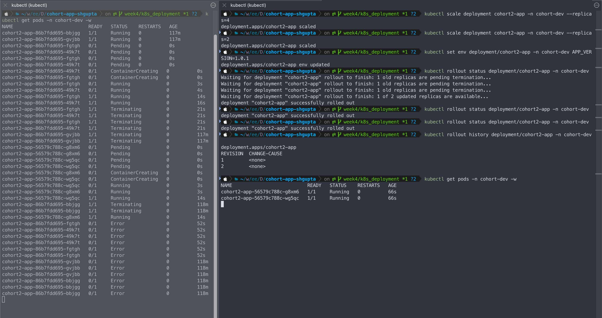

---

## 6. Self-Hosted Runner

Registered a self-hosted GitHub Actions runner on local machine (macOS ARM64) with labels: `self-hosted`, `macOS`, `ARM64`, `self-hosted-local`.

Runner configured via `./config.sh` and started with `./run.sh`. Status shows **Idle** in GitHub Settings → Actions → Runners when waiting for jobs.

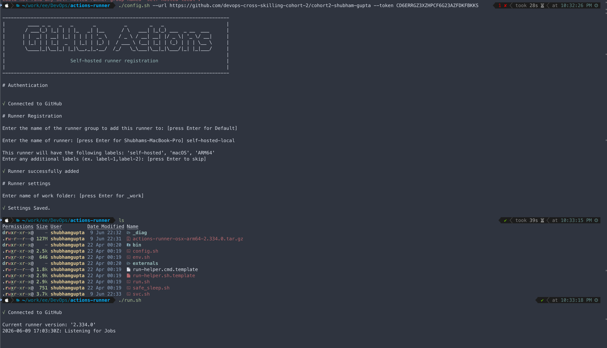

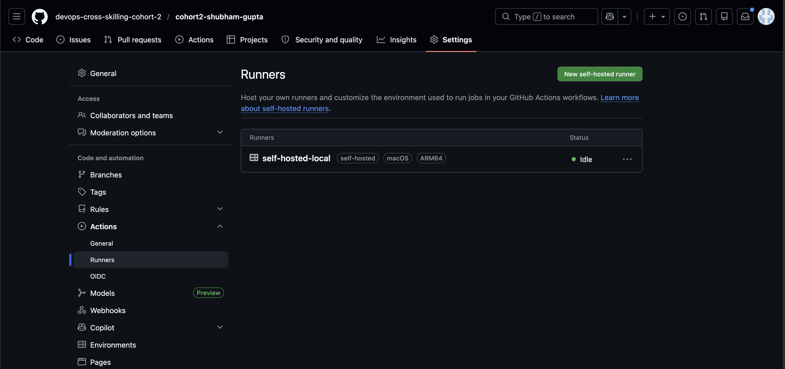

---

## 7. CI Apply Step — K8s Non-Prod Apply

`k8s-apply.yml` workflow runs on the self-hosted runner. All steps passed in 42s:

```
✅ Set up job
✅ Checkout Repository
✅ Verify Cluster Connectivity
✅ Apply Namespace
✅ Apply ConfigMap and Secret
✅ Apply Deployment and Service
✅ Wait for Rollout (18s)
✅ Verify Pods are Ready
✅ Verify Service Endpoint — returned HTTP 200
```

**Verify Service Endpoint log:**
```json
{"environment":"dev","status":"running","timestamp":"2026-06-10T10783:11:57.030641+00:00","version":"1.0.0"}
```

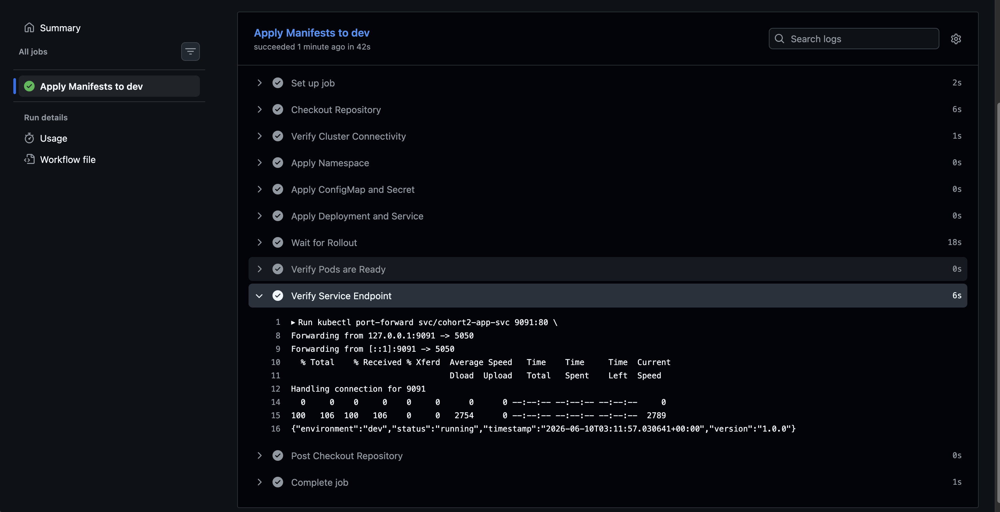

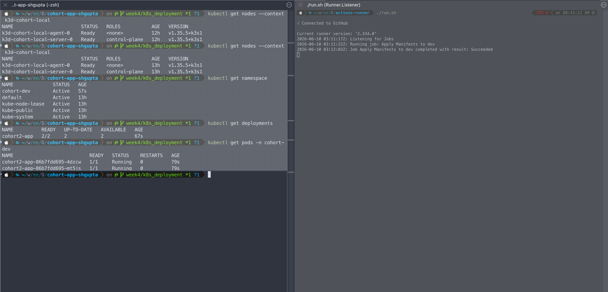

---

## Failure Drill

**Failure introduced:**
Patched the readiness probe path from `/health` to `/does-not-exist` using `kubectl patch`:
```bash
kubectl patch deployment cohort2-app -n cohort-dev \
  --type='json' \
  -p='[{"op":"replace","path":"/spec/template/spec/containers/0/readinessProbe/httpGet/path","value":"/does-not-exist"}]'
```

**Detection method:**
- `kubectl get pods -n cohort-dev` — new pods stuck at `0/1 Running` (not ready)
- `kubectl get endpoints cohort2-app-svc -n cohort-dev` — broken pods excluded from endpoint slice
- `kubectl describe pod -n cohort-dev` — Events section showed:
  ```
  Warning  Unhealthy  kubelet  Readiness probe failed: HTTP probe failed with statuscode: 404
  ```
- `kubectl get events -n cohort-dev --sort-by='.lastTimestamp'` — repeated `Unhealthy` warnings

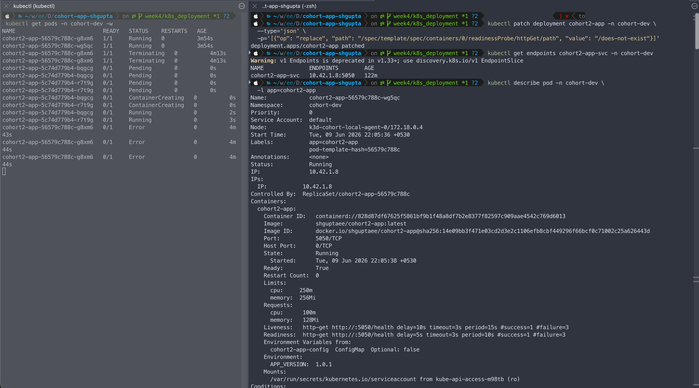

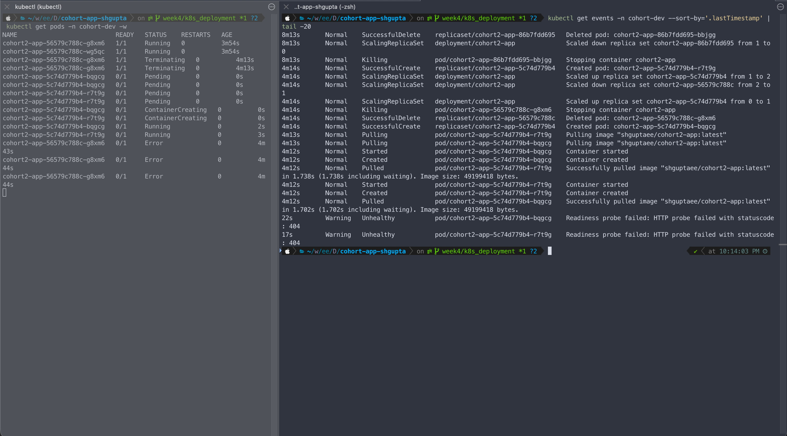

**Fix applied:**
```bash
kubectl patch deployment cohort2-app -n cohort-dev \
  --type='json' \
  -p='[{"op":"replace","path":"/spec/template/spec/containers/0/readinessProbe/httpGet/path","value":"/health"}]'
kubectl rollout status deployment/cohort2-app -n cohort-dev
```

**Result after fix:**
- Rollout completed successfully
- Both pods returned to `1/1 Running`
- Endpoints repopulated with both pod IPs
- `curl /health` returned HTTP 200

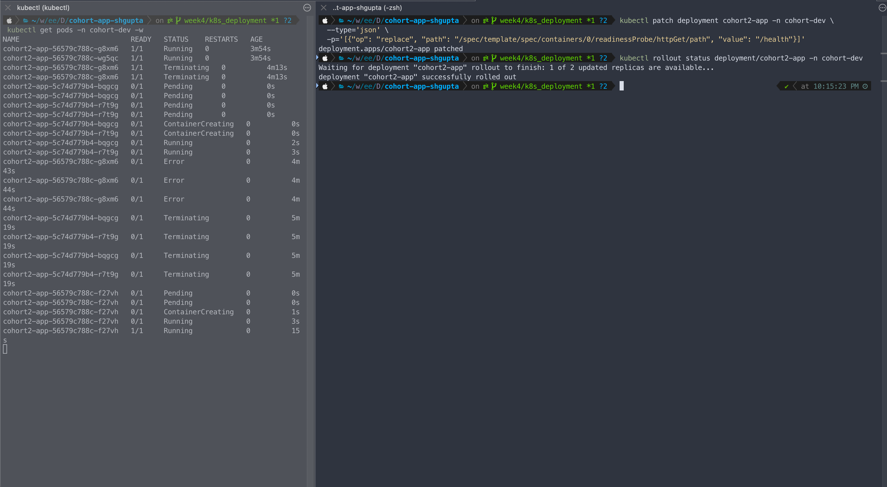

---

## Reflection

- **Hardest part:** Getting the self-hosted runner label matching right — runner was connected and idle but jobs kept waiting until `self-hosted-local` label was added via GitHub UI and the runner was restarted.
- **Learned:** Readiness probes silently exclude pods from the endpoint slice without crashing them — `kubectl get endpoints` is the right tool to confirm traffic routing, not just `kubectl get pods`.
- **Learned:** K3D spins up a full Kubernetes cluster locally in under 2 minutes — port conflicts on the host are the most common first-run failure.

---
