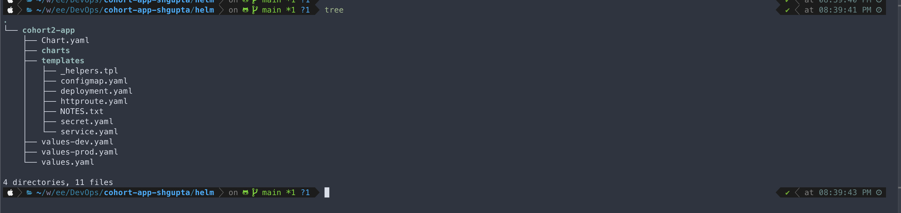
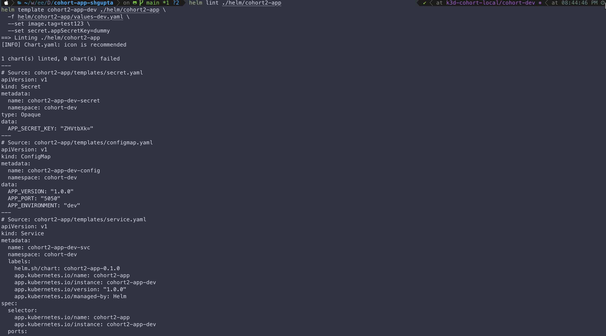
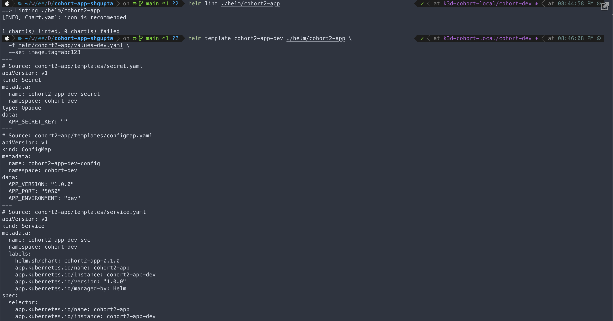
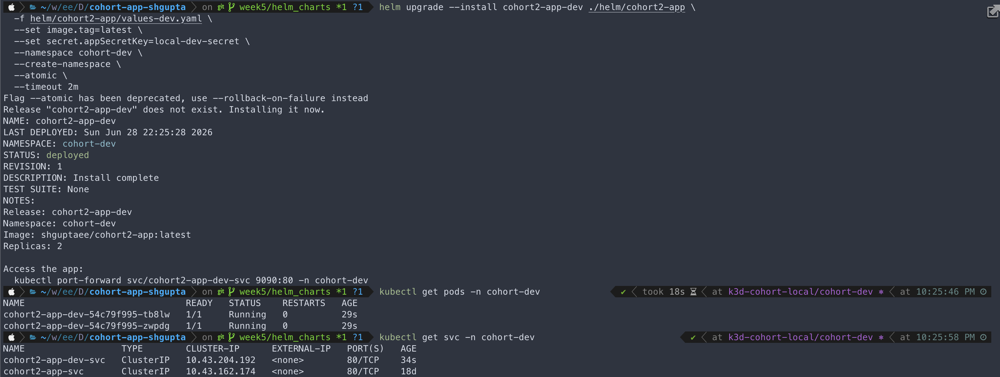
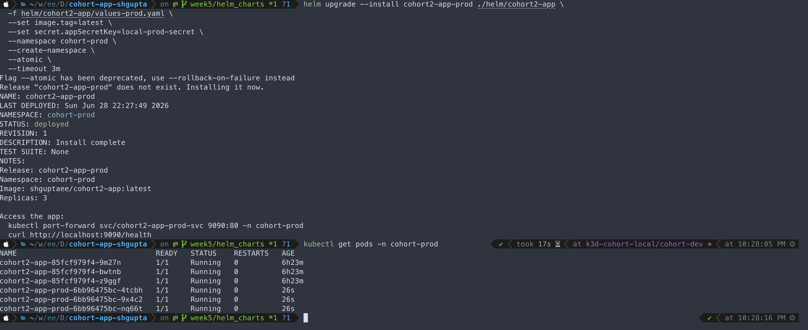
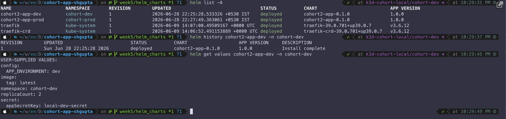
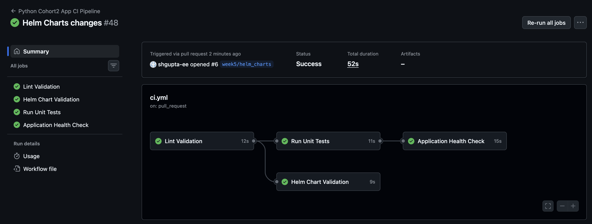
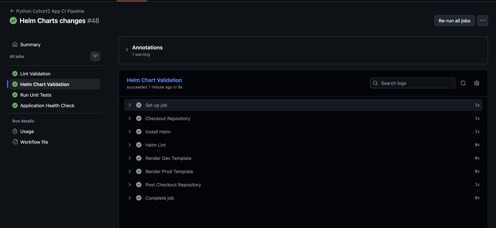
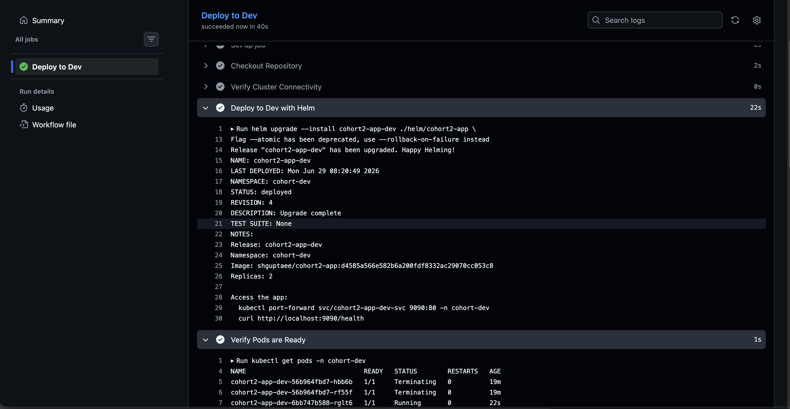
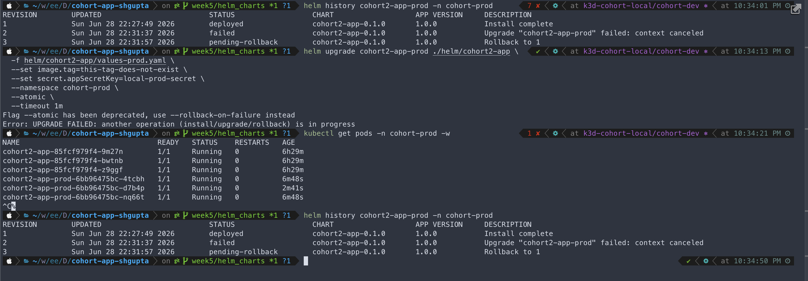

# Week 5 Evidence Pack

---

## Week
**Week number:** 5
**Assignment link:** https://github.com/devops-cross-skilling-cohort-2/cohort2-shubham-gupta
**Target path used:** A (Helm Packaging for Kubernetes)

---

## What I Implemented
- Created a Helm chart (`helm/cohort2-app`) from scratch, replacing the flat `k8s/dev/` and `k8s/prod/` manifests
- Structured chart with `values.yaml` (shared defaults), `values-dev.yaml` (dev overrides), `values-prod.yaml` (prod overrides)
- Parameterised image, replicas, probes, resources, env vars, namespace, and secret key across all templates
- Validated chart locally with `helm lint` and `helm template` before touching the cluster
- Deployed to dev (`cohort-dev`) and prod (`cohort-prod`) namespaces using `helm upgrade --install`
- Added `helm-validate` job to CI pipeline — `helm lint` + `helm template` runs on every PR
- Updated dev and prod deploy pipelines to use `helm upgrade --install --atomic` — replaced sed hack and kubectl apply steps
- Failure drill: deployed bad image tag, observed `--atomic` auto-rollback, verified cluster recovered

---

## Definition of Done Checklist
- ✅ Helm chart passes `helm lint`
- ✅ Templates render for both dev and prod
- ✅ Environment differences are intentional and documented
- ✅ Upgrade to new image tag succeeds
- ✅ Rollback restores healthy state
- ✅ Failure drill evidence included

### DoD Items
| Item | Status |
|------|--------|
| `helm lint` passes | ✅ 1 chart linted, 0 failed |
| Dev template renders correctly | ✅ `helm template` with values-dev.yaml — namespace, replicas, env verified |
| Prod template renders correctly | ✅ `helm template` with values-prod.yaml — 3 replicas, APP_ENVIRONMENT=prod |
| Environment differences documented | ✅ See "What changed by environment" section below |
| Upgrade to new image tag succeeds | ✅ `helm upgrade --install` with `--set image.tag=<sha>` |
| Rollback restores healthy state | ✅ `--atomic` auto-rollback + manual `helm rollback` demonstrated |
| Failure drill evidence included | ✅ Invalid image tag deployed, rollback verified |

---

## Evidence Pack

**Repository/PR link:** https://github.com/devops-cross-skilling-cohort-2/cohort2-shubham-gupta/pull/5

**CI run links:** GitHub Actions → Python Cohort2 App CI Pipeline → `Helm Chart Validation`

**Deployment verification proof:** `helm upgrade --install` deployed to dev and prod; health endpoint confirmed returning HTTP 200 via port-forward

**Security or quality check proof:** Secrets passed via `--set secret.appSecretKey=` at deploy time — never stored in values files or templates

---

## 1. Helm Chart Structure

The chart is under `helm/cohort2-app/`. Unnecessary generated files (`ingress.yaml`, `serviceaccount.yaml`, `hpa.yaml`, `httproute.yaml`) were deleted. A `configmap.yaml` and `secret.yaml` template were added since Helm does not generate these.

```
helm/cohort2-app/
  Chart.yaml               — chart metadata (name, version, appVersion)
  values.yaml              — shared defaults for all environments
  values-dev.yaml          — dev overrides (namespace, APP_ENVIRONMENT, replicas=2)
  values-prod.yaml         — prod overrides (namespace, APP_ENVIRONMENT, replicas=3)
  templates/
    _helpers.tpl           — reusable name/label helpers
    deployment.yaml        — parameterised with .Values.replicaCount, image, probes, resources
    service.yaml           — parameterised port and namespace
    configmap.yaml         — APP_VERSION, APP_PORT, APP_ENVIRONMENT from .Values.config
    secret.yaml            — APP_SECRET_KEY from .Values.secret.appSecretKey (b64enc)
    NOTES.txt              — post-install instructions with port-forward command
```



---

## 2. What Changed by Environment

| Parameter | `values.yaml` (default) | `values-dev.yaml` | `values-prod.yaml` |
|---|---|---|---|
| `namespace` | `cohort-dev` | `cohort-dev` | `cohort-prod` |
| `replicaCount` | `2` | `2` | `3` |
| `config.APP_ENVIRONMENT` | `dev` | `dev` | `prod` |
| `image.tag` | `latest` | overridden by `--set` at deploy time | overridden by `--set` at deploy time |
| `secret.appSecretKey` | `""` | injected via `--set` from `APP_SECRET_KEY` GitHub Secret | injected via `--set` from `APP_SECRET_KEY_PROD` GitHub Secret |

The `image.tag` is never hardcoded in any values file — it is always passed at deploy time via `--set image.tag=<sha>` (dev) or `--set image.tag=<version>` (prod).

---

## 3. Helm Lint and Local Template Validation

```bash
# Lint the chart
helm lint ./helm/cohort2-app

# Render dev
helm template cohort2-app-dev ./helm/cohort2-app \
  -f helm/cohort2-app/values-dev.yaml \
  --set image.tag=abc123 \
  --set secret.appSecretKey=dummy

# Render prod
helm template cohort2-app-prod ./helm/cohort2-app \
  -f helm/cohort2-app/values-prod.yaml \
  --set image.tag=v1.0.0 \
  --set secret.appSecretKey=dummy
```

**Lint output:**
```
==> Linting ./helm/cohort2-app
[INFO] Chart.yaml: icon is recommended

1 chart(s) linted, 0 chart(s) failed
```





---

## 4. Local Deployment to Dev and Prod

Deployed to local K3D cluster (`cohort-local`) from terminal to verify chart before pipeline:

```bash
# Deploy dev
helm upgrade --install cohort2-app-dev ./helm/cohort2-app \
  -f helm/cohort2-app/values-dev.yaml \
  --set image.tag=latest \
  --set secret.appSecretKey=local-dev-secret \
  --namespace cohort-dev \
  --create-namespace \
  --atomic \
  --timeout 2m

# Deploy prod
helm upgrade --install cohort2-app-prod ./helm/cohort2-app \
  -f helm/cohort2-app/values-prod.yaml \
  --set image.tag=latest \
  --set secret.appSecretKey=local-prod-secret \
  --namespace cohort-prod \
  --create-namespace \
  --atomic \
  --timeout 3m
```

**Confirmed:**
- Dev: 2 pods `1/1 Running` in `cohort-dev`
- Prod: 3 pods `1/1 Running` in `cohort-prod`
- Health endpoint returning HTTP 200 in both namespaces





---

## 5. Helm Release Commands

```bash
# List all releases
helm list -A

# Release history
helm history cohort2-app-dev -n cohort-dev
helm history cohort2-app-prod -n cohort-prod

# Inspect computed values
helm get values cohort2-app-dev -n cohort-dev
```



---

## 6. CI Pipeline — Helm Validation Job

Added `helm-validate` job to `ci.yml` triggered on every PR after `lint-validation`:

```
lint-validation → helm-validate → unit-tests → health-check
```

Steps in `helm-validate`:
1. Checkout repository
2. Install Helm via official script
3. `helm lint ./helm/cohort2-app`
4. `helm template` render for dev
5. `helm template` render for prod

Broken templates are now caught at PR time before anything reaches the cluster.





---

## 7. Deploy Pipeline — Helm Upgrade

Updated `k8s-apply.yml` (dev) and `k8s-prod.yml` (prod) to use `helm upgrade --install`:

**Before (kubectl approach):**
```
Pin image (sed) → apply namespace → apply configmap →
create secret → apply deployment → apply service →
kubectl rollout status → kubectl rollout restart
```

**After (Helm approach):**
```
helm upgrade --install --atomic → verify pods → verify endpoint
```

8 steps collapsed to 3. The `--atomic` flag handles rollout waiting and auto-rollback on failure — replacing both `kubectl rollout status` and `kubectl rollout restart`.



---

## Failure Drill

**Failure introduced:** deployed a non-existent image tag to prod via `helm upgrade`:

```bash
helm upgrade cohort2-app-prod ./helm/cohort2-app \
  -f helm/cohort2-app/values-prod.yaml \
  --set image.tag=this-tag-does-not-exist \
  --set secret.appSecretKey=local-prod-secret \
  --namespace cohort-prod \
  --atomic \
  --timeout 2m
```

**Detection:** pods cycled through `ErrImagePull` → `ImagePullBackOff`. After the timeout, `--atomic` automatically triggered a rollback.

**Helm history after failure:**
```
REVISION  STATUS      DESCRIPTION
1         superseded  Install complete
2         failed      Upgrade failed: timed out waiting for condition
3         deployed    Rollback to 2
```

**Result:** cluster recovered automatically — pods returned to `1/1 Running` on the previous good image. Health check passed immediately after rollback without any manual intervention.

```bash
# Verify recovery
kubectl get pods -n cohort-prod
kubectl port-forward svc/cohort2-app-prod-svc 9092:80 -n cohort-prod &
curl http://localhost:9092/health
```



---

## Release Operations Reference

### Deploy to dev
```bash
helm upgrade --install cohort2-app-dev ./helm/cohort2-app \
  -f helm/cohort2-app/values-dev.yaml \
  --set image.tag=<commit-sha> \
  --set secret.appSecretKey=<secret> \
  --namespace cohort-dev --create-namespace \
  --atomic --timeout 2m
```

### Deploy to prod
```bash
helm upgrade --install cohort2-app-prod ./helm/cohort2-app \
  -f helm/cohort2-app/values-prod.yaml \
  --set image.tag=<version-tag> \
  --set secret.appSecretKey=<secret> \
  --namespace cohort-prod --create-namespace \
  --atomic --timeout 3m
```

### Rollback prod to previous release
```bash
helm history cohort2-app-prod -n cohort-prod   # find revision number
helm rollback cohort2-app-prod <revision> -n cohort-prod
```

### Rollback prod to specific revision
```bash
helm rollback cohort2-app-prod 2 -n cohort-prod
```

---

## Reflection

- **Hardest part:** Helm's `fullname` helper generates dynamic service names (`cohort2-app-dev-svc`) that didn't match the hardcoded service names in the pipeline's `kubectl port-forward` commands — took debugging to identify it was a service name mismatch, not a connectivity issue.
- **Learned:** `--atomic` is the correct production flag over `--wait` — it not only waits but automatically rolls back on failure, meaning a bad deploy self-heals without operator intervention.
- **Learned:** `helm template` renders manifests locally with no cluster access needed — running this before every deploy gives confidence the YAML is correct before it reaches Kubernetes.
- **Learned:** The `--set` flag always wins over values files in the merge order — image tags and secrets should always be passed this way, never stored in values files.

---
